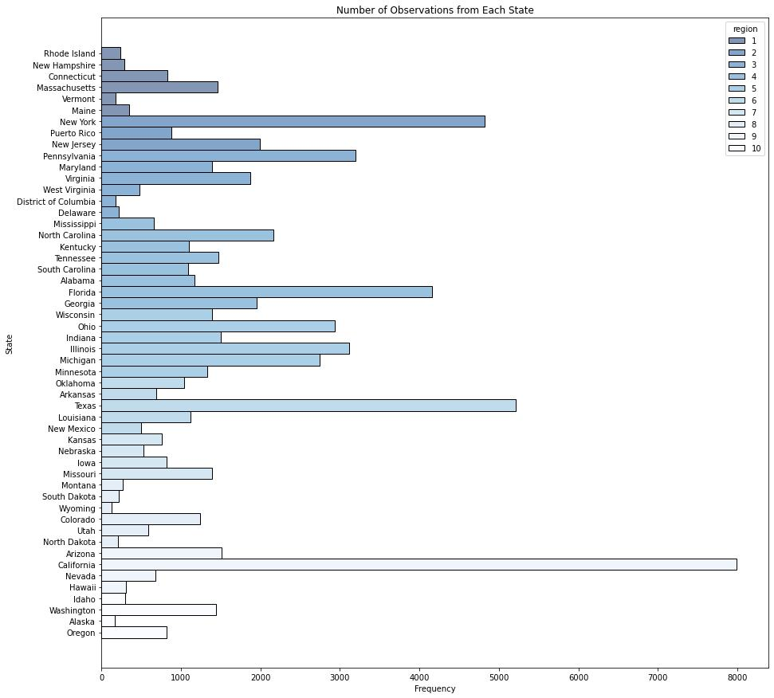
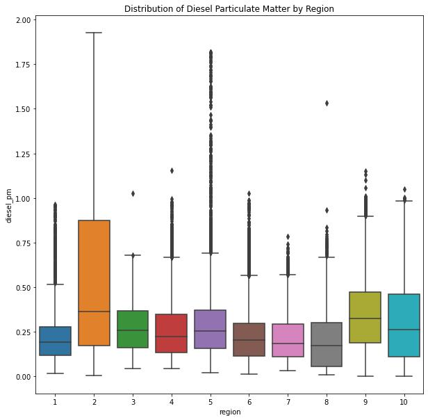
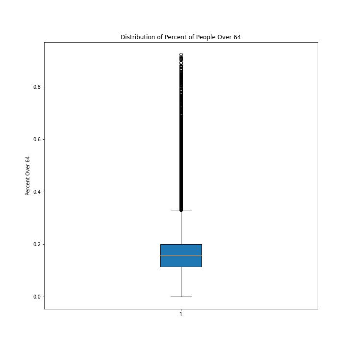
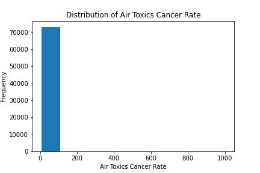
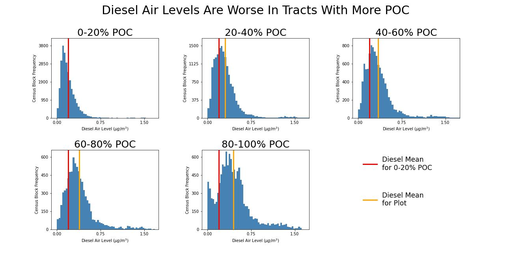
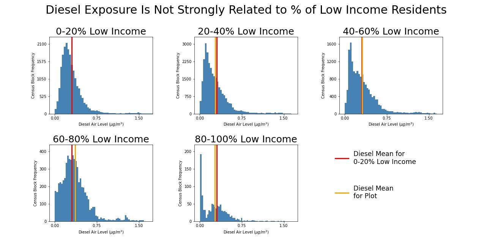
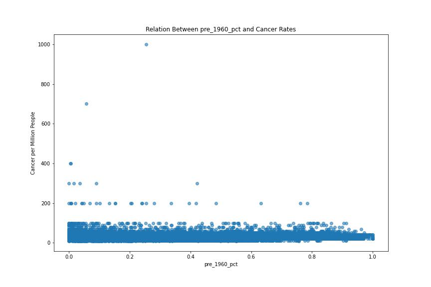
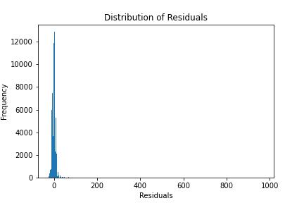
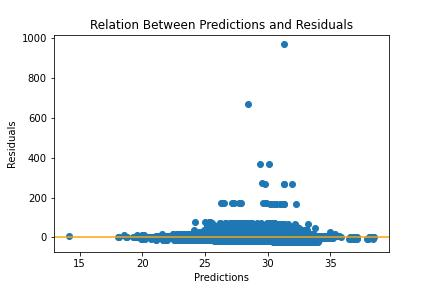

# Executive Summary 
## Problem Statement
A variety of characteristics can contribute to increased cancer rates, including environmental influences and demographic characteristics. Using the Environmental Justice Screen data provided by the United States Environmental Protection agency, we want to build regression models to predict the air toxics cancer risk per million person in each census block group using other features such as demographic information and environmental features. Additionally, we want to compare the performance of those models to a model built using only environmental feature data. This is informed by prior knowledge that low income areas and communities of color often are located near environmental hazards and have increased vulnerability to negative effects such as greater cancer risk.
Target audience: These predictions are being generated for the United States government to aid in budgeting for healthcare costs for Medicare and Medicaid for different areas in the United States.

## Description of Data
The data used in this project was sourced from the US Environmental Protection Agency's Environmental Justice Mapping and Screening Tool (EJSCREEN). The dataset gives information on various environmental and demographic features for census blocks and tracts in the United States in 2021. The dataset has 24 variables and 73,124 observations. 

## Data Dictionary

|Feature|Type|Dataset|Description|
|---|---|---|---|
|st_name|object|cleaned_ejscreen| State name| 
|st_abbrev|object|cleaned_ejscreen| State abbreviation| 
|region|integer|cleaned_ejscreen|Region number based on the Environmental Protection Agency (EPA) regions determinations, in models the region | 
|pop|integer|cleaned_ejscreen|| 
|poc_pct|float|cleaned_ejscreen|Percent people of color| 
|low_inc_pct|float|cleaned_ejscreen|Percent low income, defined as household income that is less than or equal to twice the federal poverty level.| 
|sub_hs_pct|float|cleaned_ejscreen| Percent with less than high school education| 
|ling_iso_pct|float|cleaned_ejscreen|Percent of linguistically isolated households, in which all members age 14 years and over speak a nonEnglish language and also speak English less than “very well”| 
|under_5_pct|float|cleaned_ejscreen| Percent of people under 5 years old| 
|over_64_pct|float|cleaned_ejscreen| Percent of people over 64 years old| 
|unemp_pct|float|cleaned_ejscreen| Percent unemployed| 
|pre_1960_pct|float|cleaned_ejscreen|Percent of housing units built pre-1960, as indicator of potential lead paint exposure  | 
|diesel_pm|float|cleaned_ejscreen|Diesel particulate matter level in air, µg/m3| 
|cancer|float|cleaned_ejscreen| Lifetime cancer risk from inhalation of air toxics, per million people| 
|resp_index|float|cleaned_ejscreen|Air toxics respiratory hazard index (ratio of exposure concentration to health-based reference concentration)| 
|traffic_prox|float|cleaned_ejscreen|Count of vehicles (AADT, avg. annual daily traffic) at major roads within 500 meters, divided by distance in meters| 
|npl_prox|float|cleaned_ejscreen|Count of proposed and listed NPL sites within 5 km (or nearest one beyond 5 km),each divided by distance in kilometers. National Priorities List (NPL) is the list of sites of national priority among the known releases or threatened releases of hazardous substances, pollutants, or contaminants.| 
|rmp_prox|float|cleaned_ejscreen| Count of RMP (potential chemical accident management plan) facilities within 5 km (or nearest one beyond 5 km), each divided by distance in kilometers| 
|waste_prox|float|cleaned_ejscreen|Count of TSDFs (hazardous waste management facilities) within 5 km (or nearest beyond 5 km), each divided by distance in kilometers| 
|ozone|float|cleaned_ejscreen|Ozone summer seasonal avg. of daily maximum 8-hour concentration in air in parts per billion| 
|pm_25|float|cleaned_ejscreen|Annual average of particulate matter levels in air, µg/m3| 
|undgrd_stor|float|cleaned_ejscreen|Underground storage tanks|
## Data Cleaning and Null Value Imputation 

From the raw data, columns beginning with B_ and T_ that provided information for creating specialized images were dropped, as they were not necessary for our exploratory data analysis. Columns beginning with P_ and D_  were also dropped, as they  contained percentile and index data, which was representing the same features as other columns, just in a different format. Because these could be reconstructed from other columns and were representing the same information, we felt comfortable dropping them. We also dropped the column dem_index further along in our data cleaning process when we realized this column was just the product of the poc_pct and low_inc_pct columns. We renamed our columns to be more descriptive of the variable they represented, made column names lowercase, and replaced spaces with underscores.

We then dropped all rows where the entire observation consisted of zero or null values. We dropped rows where our target value, cancer, was missing, as the variable we wanted to predict was an especially important variable for our modeling. There were only 246 rows missing a value for cancer, which was less than 1% of our data. Before dropping these rows, we checked to see if the missing values seemed random, to ensure there wasn't a pattern to the missing data. The rows with missing cancer data were relatively evenly distributed across the states, so there didn't seem to be a pattern to the null values. We found that the majority of rows missing cancer data had a population of zero. We felt comfortable dropping these rows because a population of zero clearly indicates an error in data collection. When dropping rows missing cancer data, we ended up dropping all the rows with missing diesel_pm and resp_index values, as the rows corresponded. 

The variable waste_water had 19,401 null values. This column seemed difficult to salvage, even with imputation for missing values. Additionally, this column seemed less likely to be related to our target variable of air toxics cancer rate, as it wasn't related to air pollution. Therefore, we decided to drop this column entirely.  

When looking at our columns that were measured in percent of population, we realized that our population sizes varied largely across observations; therefore a percentage of 100% in an observation with a population of 20 means something different than a percentage of 100% in an observation with a population of 5000. When looking into the reason that some observations had such a low population, we realized that while most observations represent US Census tracts, which generally have a population size above 1200, observations with lower populations represented tribal data. We did not want to completely remove tribal data, especially due to the history of environmental injustice towards indigenous people. However, we did decide to drop rows with a population under 30. This preserves much of the tribal data while allowing us more confidence in the interpretation of features measured in percent of population. 

We then looked at rows with many 0 values. While it is possible for many of this features to have accurate measurements that were 0, there were also entries of 0 that seemed like they may have been placeholders for lack of data on that feature. For example, a Census tract containing six values of 0, including values of 0 for unemployment percent, percent under 5, and percent over 64, had a population of 6,372. It is hard to imagine that there are no unemployed or elderly people in an observation with such a high population. Unfortunately, because we cannot accurately determine when these zeros are genuine zeros or missing values, we did not have a great way to correct this problem. We decided to remove rows with 5 or more 0 values. 

Next, we noticed a major outlier of 2000 in our target variable, cancer. The outlier was from Census tract data from Puerto Rico. with high POC and low income percentages, but otherwise typical values in the other columns. After further research, we were unable to find any indication that areas in Puerto Rico have extremely high instances of cancer, and therefore it is possible that this observation is an error. We decided to this outlier. 

The next largest cancer rate we see in the data is a value of 1,000 that comes from a Census tract in Louisiana. There is an infamous area in Lousiana known as ‘Cancer Alley’ with extraordinarily high cancer rates. Therefore this observation may be reasonable to leave in our dataset.

We considered dropping the remaining null values from our dataset, but realized that there was a pattern to the missing data. Dropping the null values would completely remove observations from Puerto Rico, Hawaii, and Alaska from our dataset. To address these remaining null values, we used iterative imputer with a linear regression as our estimator to impute values for the remaining null values. 

## Analysis
#### Exploratory Data Analysis
A few operations were performed as an intial exploration of the subreddit data. 

First, a bar chart was made to represent the frequency of observations of each state. The bars were color coded based on the region the state was in. 

Next, box plots were made, separated by region, for each of the environmental and demographic features in the data set to visualize the spread of data for each feature. These box plots helped to visualize outliers and compare the spread of data in different geographic regions of the United States. For example, the plot below shows the distribution of Diesel Particulate Matter for each region. Visualizing the data this way allows us to notice some variation in the distributions, with Region 2 having a larger interquartile range than any of the other regions for Diesel Particulate Matter. The plot also shows that Regions 2 and 9 had the highest medians, around 0.35, and Regions 1, 7, and 8 had the lowest medians, around 0.20. Every region has some outliers except Region 2. We used these boxplots for each feature to better understand the characteristics of the data. 

Boxplots were also made for each of the features without grouping them by region. These box plots helped visualize the overall spread of the feature and the presence of outliers calculated with the mean and standard deviation of the entire data for that feature. For example, the plot below represents the distribution of the percent of people who are over 64 in the dataset. There are some outliers, ranging up to roughly 0.90. The median is roughly 0.15. The boxplot, excluding outliers, is under 0.40. The distribution ranges from roughly 0 to 0.90. We used these boxplots for every feature to better understand the characteristics of each feature using the full data, not grouped by region. 

Histograms were also made for each of the features. These histograms helped visualize the spread of the data and identify skew. For example, in the histogram of the distribution of data for our target variable, cancer, the distribution had a significant right skew. This was important to note because later we were able adjust for that skew in our linear modeling by applying a log transformation to our target variable. 

Next, we divided our dataset into 5 groups based on percent POC values in increments of 20% (e.g. Group 1 was comprised of observations where percent POC was between 1% and 20%, Group 2 was comprised of observations where percent POC was between 20% and 40%, etc). We wanted to visualize the distribution of different environmental features for each of these groups to see if environmental data from Census tracts with higher POC representation was characteristically different from the data for tracts with lower POC representation. We created histograms for each group, and plotted the mean value from our lowest percent POC group on the subsequent histograms for the rest of the groups (with each group increasing in percent POC). These visualizations allowed us to see that the mean value of diesel particulate increased with each increase in group, meaning that the groups with higher percent POC had a higher mean diesel particulate matter.

The same approach was taken using the percent low income feature. The differences were not as marked when separating groups by percent low income. 

Finally, LINE assumptions were checked to see if, once we built a linear regression model, the coefficients of that model could be interpreted for inference. 

The LINE assumptions are:
1. Linear relationship between features and target variable 
2. Independence of observations
3. Normality of residuals
4. Equal variance of residuals 

If the LINE assumptions are violated, the model can still be used for prediction, but cannot be used for inference. 

To check for a linear relationship, scatter plots between each feature and the target variable were plotted. Each of the scatter plots did not show a linear relationship. Points were concentrated near the x-axis with a few points floating above the rest. There was no linear pattern to the plot. For example, the scatter plot below shows the relation between pre_1960_pct (percent of housing units build before 1960) and cancer. This is representative of the scatter plots between each of the features and the target variable. Our data does not meet the assumption of linear relationship between features and target variables.

To check for independence of observations, the Variance Inflation Factor (VIF) score was calculated for each of the features. The VIF score is a measure of how well a feature is explained by the other features in the data set. A high VIF score indicates multicollinearity, with a VIF score above 5 considered in violation of the assumption of independence of observations. Ten of our features had VIF scores above 5, with some features (pm_25 and ozone) having VIF scores as high as 28 and 33. Our data does not meet the assumption of independence of observations. 

To check for normality of residuals, a linear regression model was built. Predictions were made with the model, and residuals were calculated by subtracting the prediction from the true y values. A histogram of the residuals was plotted to check for normality. The residuals had a substantial right skew. Our data does not meet the assumption of normality of residuals. 

To check for the equal variance of residuals, a scatter plot of the relation between the residuals and the predictions was plotted. If the residuals had equal variance, the points on the scatterplot would be randomly distributed and show no pattern. However, in this plot the residuals clustered near the bottom of the plot and were not randomly distributed. Our data does not meet the assumption of equal variance of residuals. 

# Modeling

We built models to predict air toxic cancer rates using two different sets of features. One of our sets was comprised of all the environmental features in the dataset. The second set included all the demographic features in addition to the environmental features. We wanted to see if models including those demographic features would perform better than models with only environmental features. This was informed by prior knowledge that low income areas and communities of color often are located near environmental hazards and have increased vulnerability to negative effects such as greater cancer risk.

We fit ten different models on both sets of features (for a total of 20 models) to find which model and features best performed at predicting air toxics cancer rates. Prior to fitting our models, we split our data into a training set and a validation set so that we would be able to see how well our model performs on new data after fitting on the training data. 

We created a baseline model by setting y equal to the mean of our train data (y = ______). The baseline model had an R^2 of 
### Linear Regression

#### Environmental and Demographic Features 
We noticed during EDA that our target variable, cancer, had a substantial right skew in the distribution of data. For the linear regression, a log was performed on both y train and y val to try and normalize the distribution and build a stronger model. Therefore, our linear regression model predicts the log of y, not y. 

For our linear regression model, we built a pipeline with PolynomialFeatures, StandardScaler, and LinearRegression so we could chain our transformers and estimators and gridsearch for the best hyperparameters. We used GridSearch to check whether PolynomialFeatures degree should be 1 or 2. We did not GridSearch over regularization hyperparameters because we built separate regularized models later. The Linear Regression best parameter for PolynomialFeatures was poly__degree:[2]

We then fit this model on our X_train data. This model had an accuracy score of 0.71 on the train data and 0.70 on the validation data. The model RMSE was 7.13 for train data and 10.98 for validation data. 

#### Environmental Features Only
For this model, we again used the log of y as our target variable to adjust for the extreme right skew. Therefore, our linear regression model predicts the log of y, not y. 

For our linear regression model, we built a pipeline with PolynomialFeatures, StandardScaler, and LinearRegression so we could chain our transformers and estimators and gridsearch for the best hyperparameters. We used GridSearch to check whether PolynomialFeatures degree should be 1 or 2. We did not GridSearch over regularization hyperparameters because we built separate regularized models later. The Linear Regression best parameter for PolynomialFeatures was poly__degree:[2]

We then fit this model on our X_train data. This model had an accuracy score of 0.63 on the train data and 0.63 on the validation data. The model RMSE was 7.72 for train data and 11.42 for validation data. 

### Linear Regression with Lasso Regularization
#### Environmental and Demographic Features 
We then fit a linear model using lasso regularization. For this model, we again used the log of y as our target variable to adjust for the extreme right skew. Therefore, our linear regression model predicts the log of y, not y. 

For our linear regression model with lasso regularization, we built a pipeline with PolynomialFeatures, StandardScaler, and Lasso so we could chain our transformers and estimators and gridsearch for the best hyperparameters. We set the PolynomialFeatures degree equal to 2 because our gridsearch for the linear model without regularization performed best with a degree of 2. We used GridSearch to check for the best value to set our alpha. The Linear Regression with Lasso Regularization best parameter for alpha value was model__alpha:[0.001]

We then fit this model on our X_train data. This model had an accuracy score of 0.68 on the train data and 0.68 on the validation data. The model RMSE was 7.27 for train data and 11.15 for validation data. This model did not perform as well as the linear regression model without lasso regularization. 

#### Environmental Features Only
We then fit a linear model using lasso regularization on only the environmental features. For this model, we again used the log of y as our target variable to adjust for the extreme right skew. Therefore, our linear regression model predicts the log of y, not y. 

For our linear regression model with lasso regularization, we built a pipeline with PolynomialFeatures, StandardScaler, and Lasso so we could chain our transformers and estimators and gridsearch for the best hyperparameters. We set the PolynomialFeatures degree equal to 2 because our gridsearch for the linear model without regularization performed best with a degree of 2. We used GridSearch to check for the best value to set our alpha. The Linear Regression with Lasso Regularization best parameter for alpha value was model__alpha:[0.001]

We then fit this model on our X_train data. This model had an accuracy score of 0.62 on the train data and 0.62 on the validation data. The model RMSE was 7.75 for train data and 11.48 for validation data. This model did not perform as well as the linear regression model without lasso regularization. 

### Linear Regression with Ridge Regularization 
#### Environmental and Demographic Features
We then fit a linear model using ridge regularization. For this model, we again used the log of y as our target variable to adjust for the extreme right skew. Therefore, our linear regression model predicts the log of y, not y. 

For our linear regression model with ridge regularization, we built a pipeline with PolynomialFeatures, StandardScaler, and Ridge so we could chain our transformers and estimators and gridsearch for the best hyperparameters. We set the PolynomialFeatures degree equal to 2 because our gridsearch for the linear model without regularization performed best with a degree of 2. We used GridSearch to check for the best value to set our alpha. The Linear Regression with Ridge Regularization best parameter for alpha value was model__alpha:[3430.47]

We then fit this model on our X_train data. This model had an accuracy score of 0.68 on the train data and 0.68 on the validation data. The model RMSE was 7.24 for train data and 11.12 for validation data. This model did not perform as well as the linear regression model without ridge regularization.
#### Environmental Features Only
We then fit a linear model using ridge regularization on only the environmental features For this model, we again used the log of y as our target variable to adjust for the extreme right skew. Therefore, our linear regression model predicts the log of y, not y. 

For our linear regression model with ridge regularization, we built a pipeline with PolynomialFeatures, StandardScaler, and Ridge so we could chain our transformers and estimators and gridsearch for the best hyperparameters. We set the PolynomialFeatures degree equal to 2 because our gridsearch for the linear model without regularization performed best with a degree of 2. We used GridSearch to check for the best value to set our alpha. The Linear Regression with Ridge Regularization best parameter for alpha value was model__alpha:[335.16]

We then fit this model on our X_train data. This model had an accuracy score of 0.63 on the train data and 0.63 on the validation data. The model RMSE was 7.75 for train data and 11.48 for validation data. This model did not perform as well as the linear regression model without ridge regularization.

### Linear Regression with ElasticNet Regularization
#### Environmental and Demographic Features 
We then fit a linear model using ElasticNet regularization. For this model, we again used the log of y as our target variable to adjust for the extreme right skew. Therefore, our linear regression model predicts the log of y, not y. 

For our linear regression model with ElasticNet regularization, we built a pipeline with PolynomialFeatures, StandardScaler, and ElasticNet so we could chain our transformers and estimators and gridsearch for the best hyperparameters. We set the PolynomialFeatures degree equal to 2 because our gridsearch for the linear model without regularization performed best with a degree of 2. We used GridSearch to check for the best value to set our alpha and l1_ratio. The Linear Regression with ElasticNet Regularization best parameters were enet__alpha:[1] and enet__l1_ratio:[0.1]. 

We then fit this model on our X_train data. This model had an accuracy score of 0.32 on the train data and 0.31 on the validation data. The model RMSE was 8.77 for train data and 12.37 for validation data. This model performed much worse than the linear regression model without ElasticNet regularization.
#### Environmental Features Only
We then fit a linear model using ElasticNet regularization with only the environmental features. For this model, we again used the log of y as our target variable to adjust for the extreme right skew. Therefore, our linear regression model predicts the log of y, not y. 

For our linear regression model with ElasticNet regularization, we built a pipeline with PolynomialFeatures, StandardScaler, and ElasticNet so we could chain our transformers and estimators and gridsearch for the best hyperparameters. We set the PolynomialFeatures degree equal to 2 because our gridsearch for the linear model without regularization performed best with a degree of 2. We used GridSearch to check for the best value to set our alpha and l1_ratio. The Linear Regression with ElasticNet Regularization best parameters were enet__alpha:[1] and enet__l1_ratio:[0.1]. 

We then fit this model on our X_train data. This model had an accuracy score of 0.32 on the train data and 0.31 on the validation data. The model RMSE was 8.77 for train data and 12.37 for validation data. This model performed much worse than the linear regression model without ElasticNet regularization.
### K Nearest Neighbors
#### Environmental and Demographic Features 
We then fit a K Nearest Neighbors model. For this model, we predicted y, not log of y. 

For our KNN model, we built a pipeline with StandardScaler, and KNeighborsRegressor so we could chain our transformer and estimator and gridsearch for the best hyperparameters. We used GridSearch to check for the best values to set our n_neighbors hyperparameter. The KNN best parameter was knn__n_neighbors:[12].

We then fit this model on our X_train data. This model had an accuracy score of 0.63 on the train data and 0.38 on the validation data. The model RMSE was 6.11 for train data and 10.46 for validation data. This model did not perform as well as the linear regression model. Additionally, this model shows signs of overfitting, with a noticable decrease in R^2 score from train data to validation data. 

#### Environmental Features Only
We then fit a K Nearest Neighbors model on only the environmental features. For this model, we predicted y, not log of y. 

For our KNN model, we built a pipeline with StandardScaler, and KNeighborsRegressor so we could chain our transformer and estimator and gridsearch for the best hyperparameters. We used GridSearch to check for the best values to set our n_neighbors hyperparameter. The KNN best parameter was knn__n_neighbors:[12].

We then fit this model on our X_train data. This model had an accuracy score of 0.62 on the train data and 0.33 on the validation data. The model RMSE was 6.12 for train data and 10.49 for validation data. This model did not perform as well as the linear regression model. Additionally, this model shows signs of overfitting, with a noticable decrease in R^2 score from train data to validation data. 
### Decision Tree
#### Environmental and Demographic Features 
We then fit a Decision Tree model to predict our target variable. 

For our decision tree model, we used DecisionTreeRegressor and GridSearch to check for the best values to set our hyperparameters. Three parameters were looked at which include max_depth, max_features, and min_samples_split. The max_depth parameter determines maximum depth of the tree. The min_samples_split parameter determines the minimum number of splits required to split a node. The max_features parameter determines the number of features to consider for best split.The Decision Tree best parameters were dt__max_depth: [3], dt__max_features: [0.65] and dt__min_samples_split: [2]. 

We then fit this model on our X_train data. This model had an accuracy score of 0.42 on the train data and 0.25 on the validation data. The model RMSE was 7.58 for train data and 11.42 for validation data. This model performed much worse than the linear regression model. Additionally, this model shows signs of overfitting, with a noticable decrease in R^2 score from train data to validation data. 
#### Environmental Features Only
We then fit a Decision Tree model to predict our target variable using only environmental features. 

For our decision tree model, we used DecisionTreeRegressor and GridSearch to check for the best values to set our hyperparameters. Three parameters were looked at which include max_depth, max_features, and min_samples_split. The max_depth parameter determines maximum depth of the tree. The min_samples_split parameter determines the minimum number of splits required to split a node. The max_features parameter determines the number of features to consider for best split.The Decision Tree best parameters were dt__max_depth: [5], dt__max_features: [0.85] and dt__min_samples_split: [2]. 

We then fit this model on our X_train data. This model had an accuracy score of 0.46 on the train data and 0.26 on the validation data. The model RMSE was 7.34 for train data and 11.38 for validation data. This model performed much worse than the linear regression model. Additionally, this model shows signs of overfitting, with a decrease in R^2 score from train data to validation data. 
### Bagging Regressor
#### Environmental and Demographic Features 
We then fit a Bagging Regressor model to predict our target variable. 

For our bagging regressor model, we used BaggingRegressor and  GridSearch to check for the best values to set our hyperparameters. Three parameters were looked at which include n_estimators, max_samples, and max_features. The Bagging Regressor best parameters were bag__max_features: [0.65], bag__max_samples: [0.85], and bag__n_estimators: [15]

We then fit this model on our X_train data. This model had an accuracy score of 0.92 on the train data and 0.47 on the validation data. The model RMSE was 2.85 for train data and 9.62 for validation data. This model performed much worse than the linear regression model. Additionally, this model shows signs of overfitting, with a noticable decrease in R^2 score from train data to validation data. 
#### Environmental Features Only
We then fit a Bagging Regressor model to predict our target variable using only environmental features. 

For our bagging regressor model, we used BaggingRegressor and  GridSearch to check for the best values to set our hyperparameters. Three parameters were looked at which include n_estimators, max_samples, and max_features. The Bagging Regressor best parameters were bag__max_features: [0.65], bag__max_samples: [0.85], and bag__n_estimators: [15]

We then fit this model on our X_train data. This model had an accuracy score of 0.90 on the train data and 0.39 on the validation data. The model RMSE was 3.19 for train data and 10.29 for validation data. This model performed much worse than the linear regression model. Additionally, this model shows signs of overfitting, with a noticable decrease in R^2 score from train data to validation data. 
### Random Forest
#### Environmental and Demographic Features 
We then fit a Random Forest model to predict our target variable. 

For our random forest model, we used RandomForestRegressor and GridSearch to check for the best values to set our hyperparameters. Four parameters were looked at which include n_estimators, max_depth, max_features, and max_samples. The Random Forest best parameters were rf__max_depth: [9], rf__max_features: ['sqrt'], rf__max_samples: [0.85], and rf__n_estimators: [150].

We then fit this model on our X_train data. This model had an accuracy score of 0.66 on the train data and 0.36 on the validation data. The model RMSE was 5.82 for train data and 10.62 for validation data. This model performed much worse than the linear regression model. Additionally, this model shows signs of overfitting, with a noticable decrease in R^2 score from train data to validation data. 
#### Environmental Features Only
We then fit a Random Forest model to predict our target variable using only environmental features. 

For our random forest model, we used RandomForestRegressor and GridSearch to check for the best values to set our hyperparameters. Four parameters were looked at which include n_estimators, max_depth, max_features, and max_samples. The Random Forest best parameters were rf__max_depth: [7], rf__max_features: ['sqrt'], rf__max_samples: [0.65], and rf__n_estimators: [150].

We then fit this model on our X_train data. This model had an accuracy score of 0.53 on the train data and 0.30 on the validation data. The model RMSE was 6.82 for train data and 11.10 for validation data. This model performed much worse than the linear regression model. Additionally, this model shows signs of overfitting, with a noticable decrease in R^2 score from train data to validation data. 

### AdaBoost
#### Environmental and Demographic Features 
We then fit an AdaBoost model to predict our target variable. 

For our AdaBoost model, we used AdaBoostRegressor and GridSearch to check for the best values to set our hyperparameters. Three parameters were looked at which include n_estimators, learning_rate, and ada_loss. The AdaBoost best parameters were ada__learning_rate: [0.75], ada__loss: ['linear'],and ada__n_estimators: [25].

We then fit this model on our X_train data. This model had an accuracy score of 0.29 on the train data and 0.13 on the validation data. The model RMSE was 8.39 for train data and 12.32 for validation data. This model performed much worse than the linear regression model. Additionally, this model shows signs of overfitting, with a decrease in R^2 score from train data to validation data. 
#### Environmental Features Only
We then fit an AdaBoost model to predict our target variable using only environmental features. 

For our AdaBoost model, we used AdaBoostRegressor and GridSearch to check for the best values to set our hyperparameters. Three parameters were looked at which include n_estimators, learning_rate, and ada_loss. The AdaBoost best parameters were ada__learning_rate: [1.25], ada__loss: ['square'],and ada__n_estimators: [25].

We then fit this model on our X_train data. This model had an accuracy score of 0.01 on the train data and 0.00 (a very small negative decimal rounded to zero) on the validation data. The model RMSE was 9.92 for train data and 13.23 for validation data. This model performed much worse than the linear regression model.
### Gradient Boost
#### Environmental and Demographic Features 
We then fit a Gradient Boost model to predict our target variable using only environmental features. 

For our Gradient Boost model, we built a pipeline with GradientBoostingRegressor and StandardScaler() and used GridSearch to check for the best values to set our hyperparameters. Four paramters were looked at which include max_depth, n_estimator, learning_rate, and min_samples_split. The Gradient Boost best parameters were g_boost__learning_rate: [0.1], g_boost__max_depth: [2], g_boost__min_samples_split: [2], and g_boost__n_estimators: [100].

We then fit this model on our X_train data. This model had an accuracy score of 0.53 on the train data and 0.31 on the validation data. The model RMSE was 6.85 for train data and 10.96 for validation data. This model performed much worse than the linear regression model. Additionally, this model shows signs of overfitting, with a decrease in R^2 score from train data to validation data. 
#### Environmental Features Only
We then fit a Gradient Boost model to predict our target variable. 

For our Gradient Boost model, we built a pipeline with GradientBoostingRegressor and StandardScaler() and used GridSearch to check for the best values to set our hyperparameters. Four paramters were looked at which include max_depth, n_estimator, learning_rate, and min_samples_split. The Gradient Boost best parameters were g_boost__learning_rate: [0.1], g_boost__max_depth: [2], g_boost__min_samples_split: [2], and g_boost__n_estimators: [100].

We then fit this model on our X_train data. This model had an accuracy score of 0.49 on the train data and 0.29 on the validation data. The model RMSE was 7.11 for train data and 11.18 for validation data. This model performed much worse than the linear regression model. Additionally, this model shows signs of overfitting, with a decrease in R^2 score from train data to validation data. 

## Conclusions and Recommendations 

Our aim in this project was to find which regression model best predicted air toxics cancer rate using environmental and/or demographic features. Our best model as evaluated by R^2 was a linear regression model with no regularization that predicts the log of y (air toxics cancer rates) using both environmental and demographic features. The model has an R^2 score of .70 on validation data, meaning that 70% of the variation in air toxics cancer rate can be explained by the features in the model. This model also did not suffer from overfitting, with only a 0.01 decrease in R^2 score from the train data to the validation data. 

We were unable to use this linear model to infer the weights of each feature from the coefficient, because the model did not meet the LINE assumptions necessary for inference. 

When comparing the performance of each of the ten models we tested on the environmental features vs. the environmental and demographic features, the model that included the demographic features alway performed equally, or more often, better, than the equivalent model using only environmental features. This was in line with our previous knowledge that factors like race/ethnicity and income often influence people's proximity and exposure to environmental pollutants. Additionally, this reflects the higher mean values on hazardous features like diesel particulate matter for the groups with higher percent POC. Because of this, the demographic features are an important contribution to our models. 

Given the many factors outside of environmental features that contribute to rates of cancer, a model that explains 70% of the variance in air toxics cancer rates is a model that performs well. We recommend that the US government use this model to predict rates of air toxics cancer in different regions to inform their allocation of resources when making a budget for Medicare and Medicaid expenses. 

In the future, this model can be expanded to include more accurate measures of environmental risks. For example, lead exposure is measured by the number of housing units built before 1960 (which are more likely to have lead paint), which is only an approximation of the construct of lead exposure. Improving the way that some of the features are measured could result in a more accurate prediction model. Additionally, the model could be built using more specific demographic features; for example, percent POC could become more specific by breaking down further into different race/ethnicities. This could introduce more nuance in the model and improve the predictions. 

